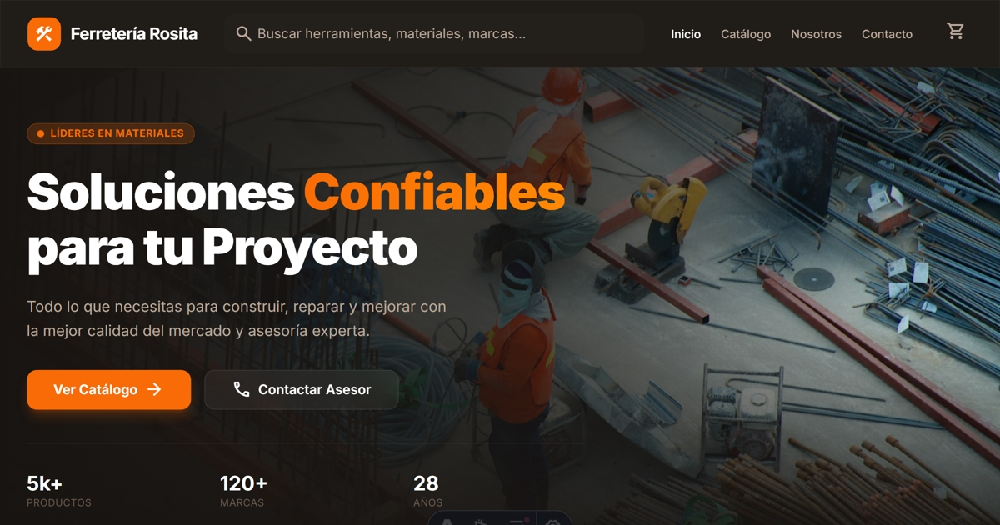

# 🏪 Ferretería Rosita

E-commerce moderno para Ferretería Rosita - Materiales de construcción y ferretería en Lima, Perú.



## ✨ Características

- 🛒 **Catálogo de Productos** con filtros por categoría, marca y precio
- 🔍 **Buscador Instantáneo** con resultados en tiempo real
- 🛍️ **Carrito de Compras** con integración a WhatsApp
- 🧮 **Calculadoras de Materiales** (ladrillos, pintura) con estándares peruanos
- 📱 **PWA Ready** con iconos y manifest
- 🎨 **Diseño Premium** con glassmorphism y animaciones
- 📧 **Formulario de Contacto** con envío a WhatsApp
- ❓ **Página FAQ** con acordeón interactivo
- 🔧 **SEO Optimizado** con Schema.org, Open Graph y meta tags

## 🛠️ Tech Stack

- **Framework**: [Astro](https://astro.build) v5
- **Styling**: [TailwindCSS](https://tailwindcss.com) v4
- **Icons**: [Material Symbols](https://fonts.google.com/icons)
- **State**: [Nanostores](https://github.com/nanostores/nanostores)
- **Content**: Astro Content Collections

## 🚀 Instalación

```bash
# Clonar repositorio
git clone [url-del-repo]

# Instalar dependencias
pnpm install

# Iniciar desarrollo
pnpm dev

# Build producción
pnpm build
```

## 📁 Estructura del Proyecto

```
src/
├── components/       # Componentes reutilizables
│   ├── cart/         # Carrito de compras
│   ├── catalog/      # Catálogo y filtros
│   ├── common/       # Header, Footer, SEO
│   └── home/         # Secciones del home
├── config/           # Configuración centralizada
│   └── site.ts       # Datos del negocio, contacto, SEO
├── content/          # Content Collections
│   └── products/     # Productos en Markdown
├── layouts/          # Layouts principales
├── lib/              # Utilidades y lógica
├── pages/            # Rutas de páginas
│   ├── api/          # API endpoints
│   └── catalogo/     # Catálogo dinámico
└── stores/           # Nanostores (carrito, formularios)
```

## 📚 Documentación

| Documento | Descripción |
|-----------|-------------|
| [CALCULADORAS.md](DOCS/CALCULADORAS.md) | Fórmulas de calculadoras |
| [INSTANT-SEARCH.md](DOCS/INSTANT-SEARCH.md) | Implementación del buscador |
| [IMAGE-GENERATION-PLAN.md](DOCS/IMAGE-GENERATION-PLAN.md) | Plan para imágenes de productos |

## 🧞 Comandos

| Comando | Descripción |
|---------|-------------|
| `pnpm dev` | Servidor de desarrollo en `localhost:4321` |
| `pnpm build` | Build de producción a `./dist/` |
| `pnpm preview` | Preview del build |
| `node scripts/generate-icons.js` | Generar iconos PWA |

## 📄 Licencia

Este proyecto es software propietario. Ver [LICENSE](LICENSE) para más detalles.

---

<div align="center">
  <p>Desarrollado por <a href="https://www.hebert.dev" target="_blank">Hebert.Dev</a></p>
  <p>¿Te gustaría una landing page como esta? <a href="mailto:hola@hebert.dev">Contáctame</a></p>
</div>
